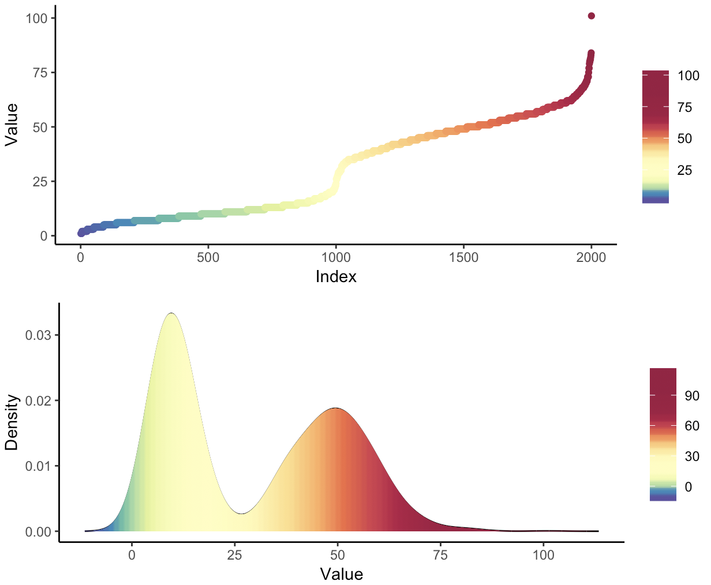

# Figures
The function maps a colour pallete to a non linear distribution

## ColouRMap    
Input:  
n = number of colours to output   
val = the values on which to map (vector, matrix, dataframe)  
pal = a pallete (default is spectral)  
  
Ouput:  
vector of colours in Hex  

## ColouRMapPlot 
Dependencies:  
ggplot, gridExtra  
  
Input:  
val = distribution (vector, matrix, dataframe)  
pal = a pallete (default is spectral)  
  
Output:  
plot palete mapped on density and values of data

## Example
#Data 1   
x1 = rnbinom(1000, 10, .5)  
x2 = rnbinom(1000,50,.5)  
x = c(x1,x2) 

y = ColoRMap(200,x)  
ColoRMapPlot(x,y)  

